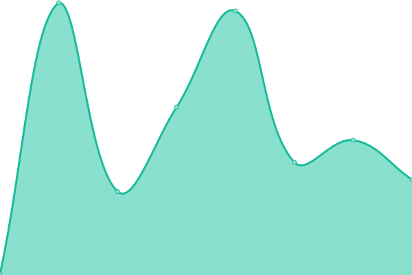
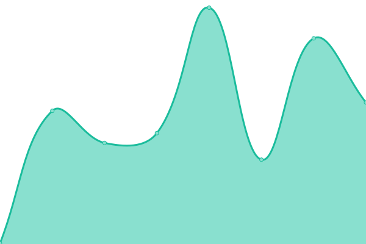

# [📈 Live Status](https://timching/upptime.github.io/timching/upptime): <!--live status--> **🟩 All systems operational**

This repository contains the open-source uptime monitor and status page for [timching/upptime](https://timching/upptime.github.io/timching/upptime), powered by [Upptime](https://github.com/upptime/upptime).

With [Upptime](https://upptime.js.org), you can get your own unlimited and free uptime monitor and status page, powered entirely by a GitHub repository. We use [Issues](https://github.com/timching/upptime/timching/upptime/issues) as incident reports, [Actions](https://github.com/timching/upptime/timching/upptime/actions) as uptime monitors, and [Pages](https://timching/upptime.github.io/timching/upptime) for the status page.

<!--start: status pages-->
<!-- This summary is generated by Upptime (https://github.com/upptime/upptime) -->
<!-- Do not edit this manually, your changes will be overwritten -->
<!-- prettier-ignore -->
| URL | Status | History | Response Time | Uptime |
| --- | ------ | ------- | ------------- | ------ |
|  [BECCAR](https://atelierbeccar.com) | 🟩 Up | [beccar.yml](https://github.com/timching/upptime/commits/HEAD/history/beccar.yml) | 

 227ms
     
 | 

<a href="https://timching.github.io/upptime/history/beccar">100.00%</a>
    

|  [BECCAR (Legacy)](https://beccarcouture.com) | 🟩 Up | [beccar-legacy.yml](https://github.com/timching/upptime/commits/HEAD/history/beccar-legacy.yml) | 

 157ms
     
 | 

<a href="https://timching.github.io/upptime/history/beccar-legacy">100.00%</a>
    

|  [LA CURVE / BECCAR](https://la-curve.com) | 🟩 Up | [la-curve-beccar.yml](https://github.com/timching/upptime/commits/HEAD/history/la-curve-beccar.yml) | 

 314ms
     
 | 

<a href="https://timching.github.io/upptime/history/la-curve-beccar">100.00%</a>
    

<!--end: status pages-->

[**Visit our status website →**](https://timching/upptime.github.io/timching/upptime)

## 📄 License

- Powered by: [Upptime](https://github.com/upptime/upptime)
- Code: [MIT](./LICENSE) © [Anand Chowdhary](https://anandchowdhary.com), supported by [Pabio](https://pabio.com)
- Data in the `./history` directory: [Open Database License](https://opendatacommons.org/licenses/odbl/1-0/)
